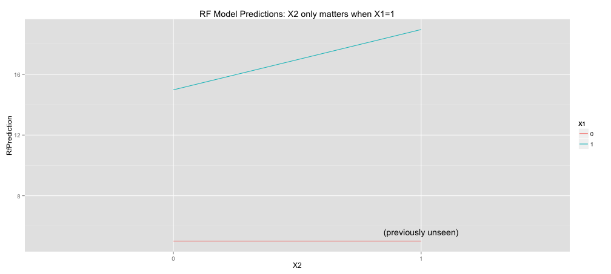

## Training Data

 

<!-- html table generated in R 3.1.1 by xtable 1.7-3 package -->
<!-- Fri Jan 23 09:58:01 2015 -->
<TABLE border=1>
<TR> <TH> X1 </TH> <TH> X2 </TH> <TH> Y </TH> <TH> N Training Rows: </TH>  </TR>
  <TR> <TD align="center"> 0 </TD> <TD align="center"> 0 </TD> <TD align="center"> Y = 5 + N(0, sd=.2) </TD> <TD align="center"> 52 </TD> </TR>
  <TR> <TD align="center"> 1 </TD> <TD align="center"> 0 </TD> <TD align="center"> Y = 15 + N(0, sd=.2) </TD> <TD align="center"> 23 </TD> </TR>
  <TR> <TD align="center"> 1 </TD> <TD align="center"> 1 </TD> <TD align="center"> Y = 19 + N(0, sd=.2) </TD> <TD align="center"> 25 </TD> </TR>
  <TR> <TD align="center"> 0 </TD> <TD align="center"> 1 </TD> <TD align="center"> ? </TD> <TD align="center"> 0 </TD> </TR>
   </TABLE>

## Another view of the training data:

 

## A Linear Model


```r
lmFit <- lm(Y ~ X1 + X2, data = train)
```

Model: $$\mathbb{E}[Y] = \beta_0 + \beta_1 X_1 + \beta_2 X_2$$


You find:

$$\mathbb{E}[Y] = 5 + 10 X_1 + 4 X_2.$$

 

## Random Forest (and decision trees)


```r
rfFit <- randomForest(Y ~ X1 + X2, data = train, mtry=2)
```

 


```
##   X1 X2 Unseen LmPrediction RfPrediction
## 1  0  0  FALSE        5.013        5.012
## 2  1  0  FALSE       14.980       14.980
## 3  0  1   TRUE        8.988        5.012
## 4  1  1  FALSE       18.955       18.956
```

