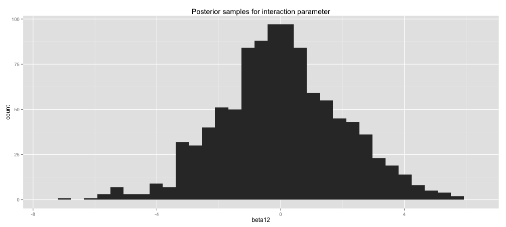
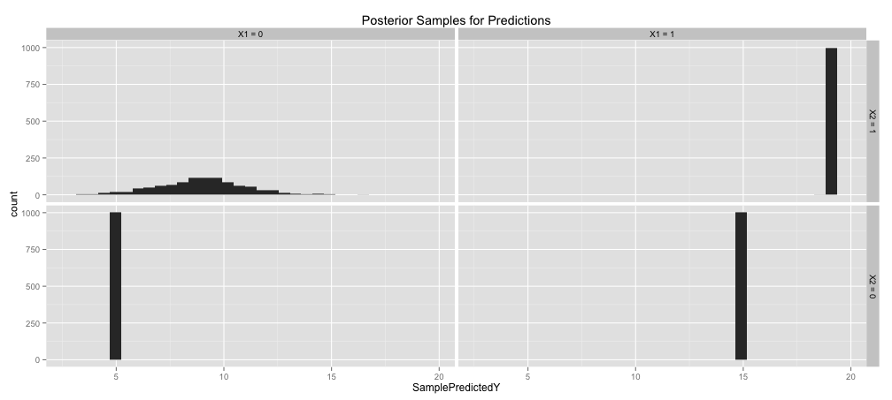
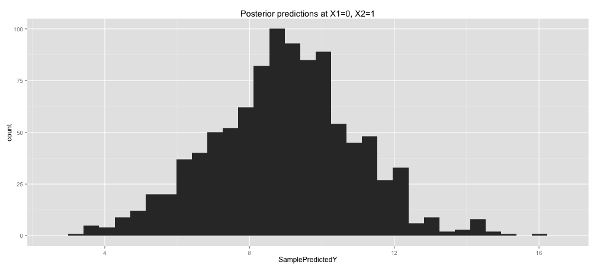

## Training Data

 

<!-- html table generated in R 3.1.1 by xtable 1.7-3 package -->
<!-- Fri Jan 23 10:04:33 2015 -->
<TABLE border=1>
<TR> <TH> X1 </TH> <TH> X2 </TH> <TH> Y </TH> <TH> N Training Rows: </TH>  </TR>
  <TR> <TD align="center"> 0 </TD> <TD align="center"> 0 </TD> <TD align="center"> Y = 5 + small noise </TD> <TD align="center"> 52 </TD> </TR>
  <TR> <TD align="center"> 1 </TD> <TD align="center"> 0 </TD> <TD align="center"> Y = 15 + small noise </TD> <TD align="center"> 23 </TD> </TR>
  <TR> <TD align="center"> 1 </TD> <TD align="center"> 1 </TD> <TD align="center"> Y = 19 + small noise </TD> <TD align="center"> 25 </TD> </TR>
  <TR> <TD align="center"> 0 </TD> <TD align="center"> 1 </TD> <TD align="center"> ? </TD> <TD align="center"> 0 </TD> </TR>
   </TABLE>

## Another view of the training data:

 

## A Linear Model


```r
lmFit <- lm(Y ~ X1 + X2, data = train)
```

Model: $$\mathbb{E}[Y] = \beta_0 + \beta_1 X_1 + \beta_2 X_2$$


You find:

$$\mathbb{E}[Y] = 5 + 10 X_1 + 4 X_2.$$

 

## Random Forest (and decision trees)


```r
rfFit <- randomForest(Y ~ X1 + X2, data = train, mtry=2)
```

 


## Linear Regression with Regularized Interaction Term

$$Y = \beta_0 + \beta_1 X_1 + \beta_2 X_2 + \beta_{12} X_1 X_2 + N(0,\sigma)$$

Too many free parameters - need a prior:

$$\beta_{12} \sim N(0,2)$$


```r
library(rstan)

stanModel1 <- "
data {
int<lower=0> N;
vector[N] X1;
vector[N] X2;
vector[N] Y;
}
parameters {
real beta0;
real beta1;
real beta2;
real beta12;
real<lower=0> sigma;
}
model {
beta12 ~ normal(0, 2);
Y ~ normal(beta0 + beta1*X1 + beta2*X2 + beta12*X1 .* X2, sigma);
}
"
```


## Posterior Samples Instead of One Prediction 

 

## Posterior Distribution of Interaction Parameter

 

## More Directly Look at Distribution of Predictions

 

 

## When $\beta_{12}$ is High, $\beta_2$ is Low (and vice versa)

 

What if we were to regularize the main effects as well as the interaction term?

## BART

Each BART sample is a sum-of-trees model, e.g.:


```r
library(bartMachine)
nIterAfterBurnIn <- 100000
bartFit <- bartMachine(train[c("X1","X2")], train$Y, 
                       num_burn_in=50000, 
                       num_trees=10, 
                       num_iterations_after_burn_in=nIterAfterBurnIn)
```

## BART Predictions are Appropriately Uncertain


 

## Advantages of BART:

- "machine learning style model" (see distinctions in Dan's talk: automatically find interactions, etc.)
- can be uncertain where appropriate
- Note: "bootstrapped" confidence intervals would not help the random forest 
